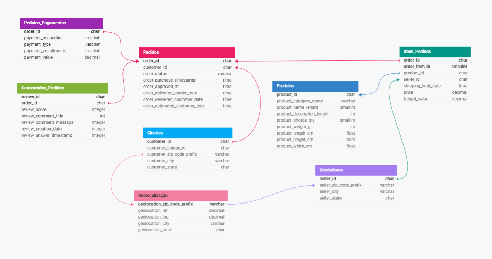
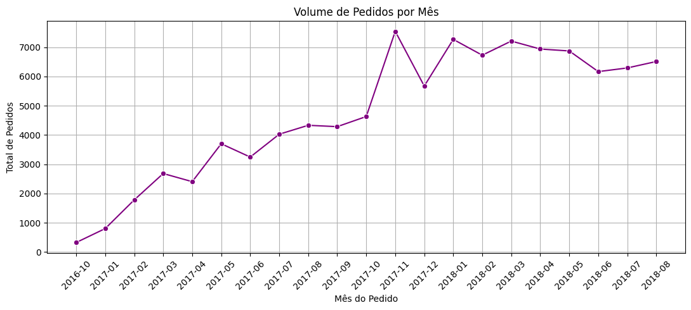
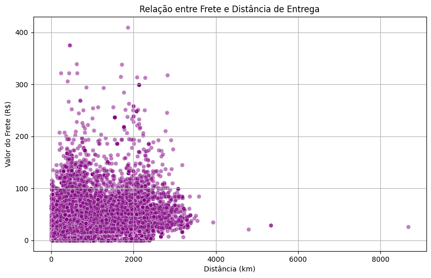
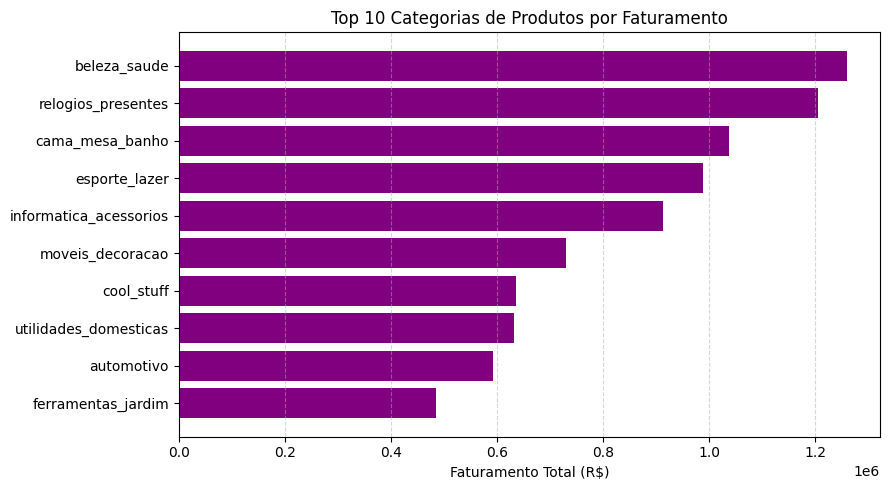
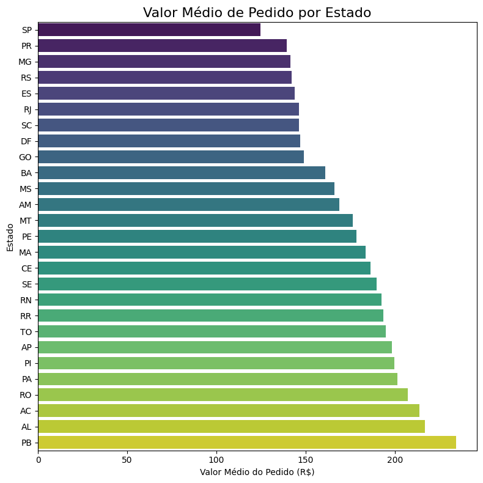

# 📦 Análise de Dados - Olist

Este projeto é uma análise exploratória dos dados de vendas da Olist.

## 📁 Sobre o Projeto

A Olist é uma plataforma de e-commerce que conecta pequenos lojistas aos grandes marketplaces. Neste projeto, foram respondidas perguntas de negócio importantes, utilizando um processo completo de ETL (Extração, Transformação e Carga de dados) e visualização.

## 🧰 Tecnologias Utilizadas

- Python 3.11  
- Pandas  
- SQLite (sqlite3)  
- Matplotlib  
- Seaborn
- GitHub

## 📁 Estrutura do Projeto

projeto-olist/  
├── dados/                         # Arquivos CSV  
├── imagens/                       # Imagens e gráficos utilizados  
├── notebook/                      # Análise de dados com código Python e SQL  
├── README.md                      # Documentação do projeto  
├── banco de dados/                # Banco de dados SQLite  

## 🗺️ Modelo Relacional do Banco de Dados

## 📊 Principais Análises  

### 🔍 Volume de pedidos por mês + Sazonalidade

A série temporal dos pedidos mensais mostra uma tendência de crescimento contínuo entre 2017 e meados de 2018. Notam-se picos significativos em Novembro/17 e Janeiro/18, possivelmente relacionados a eventos como Black Friday e promoções de início de ano. Houve também queda em Fevereiro, sugerindo sazonalidade ligada ao calendário.  

Foram removidos meses incompletos (como Setembro/2016 e Outubro/2018) para evitar distorções na análise.

---

### 🎯 Distribuição do tempo de entrega dos pedidos

A média geral de tempo entre a compra e a entrega é de aproximadamente 12,5 dias, o que indica um tempo razoável para entregas em nível nacional.  

A entrega mais rápida registrada ocorreu em menos de 1 dia, o que pode estar relacionado a compras locais ou uso de fretes expressos.

Já a entrega mais demorada levou mais de 209 dias, o que indica a presença de outliers no banco de dados, possivelmente causados por reentregas, problemas logísticos ou atrasos excepcionais.

---

### 📍 Relação entre Valor do Frete e Distância

Foi analisada a correlação entre a distância geográfica (em km) entre vendedores e clientes e o valor pago pelo frete. O coeficiente de correlação de 0,38 indica uma relação positiva moderada entre essas variáveis. Ou seja, em média, quanto maior a distância entre as partes envolvidas na entrega, maior tende a ser o valor do frete.

O gráfico de dispersão reforça essa análise: embora exista uma concentração de pontos em distâncias menores com fretes mais baixos, observa-se uma tendência de aumento no valor do frete à medida que a distância cresce. No entanto, a grande dispersão dos dados mostra que outros fatores também influenciam no custo do frete, como:
- Peso e volume do produto;
- Modalidade de entrega (convencional, expressa etc.);
- Localidade (zonas urbanas ou áreas remotas);
- Promoções ou subsídios da empresa.

Essa análise evidencia que a distância é um fator relevante, mas não exclusivo, na composição do custo do frete. Recomendamos, portanto, considerar variáveis adicionais para uma precificação de frete mais precisa e otimizada.  

---

### 🛍️ Categorias com Maior Faturamento

  

As categorias "beleza_saude", "relogios_presentes" e "cama_mesa_banho" lideram o faturamento, sugerindo alta demanda ou ticket médio elevado nesses segmentos.

---

### 🗺️ Estados com Maior Valor Médio de Pedido

Estados do Norte e Nordeste tendem a ter valores médios mais altos, o que pode indicar:

- Fretes mais caros (distância dos centros de distribuição).
- Compras em menor frequência, mas com maior volume.

SP, RJ e MG, apesar de concentrarem o maior número de pedidos, têm valores médios menores, talvez por:

- Maior concorrência.
- Mais compras pequenas e recorrentes.

---

## 📈 Problemas de Negócio

## 📝 Autora
Feito com 💙 por Bianca ✨  
📎 [Meu LinkedIn](https://www.linkedin.com/in/bianca-nunes-batista-80a468248/?profileId=ACoAAD1K0IoBIBVPe0QuvJ1MBkYvZHqu7knnX5w)
